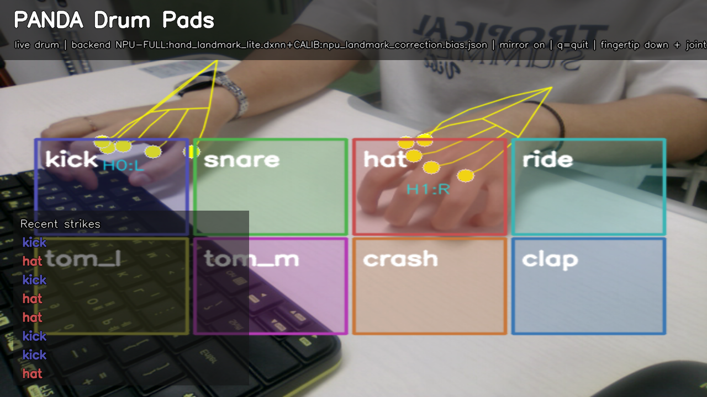
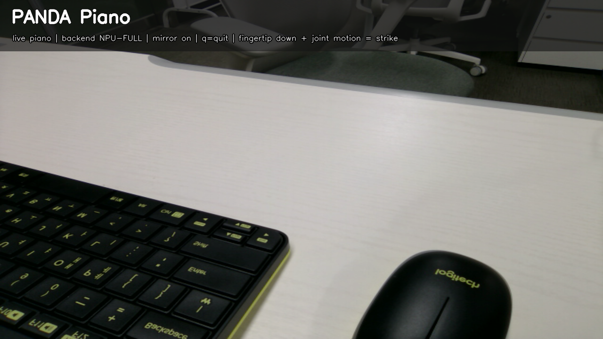
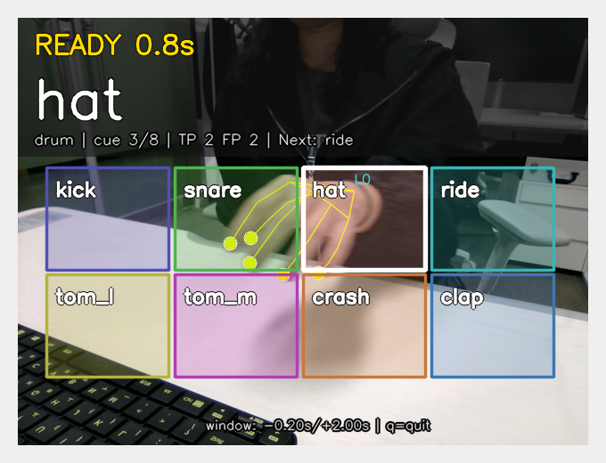
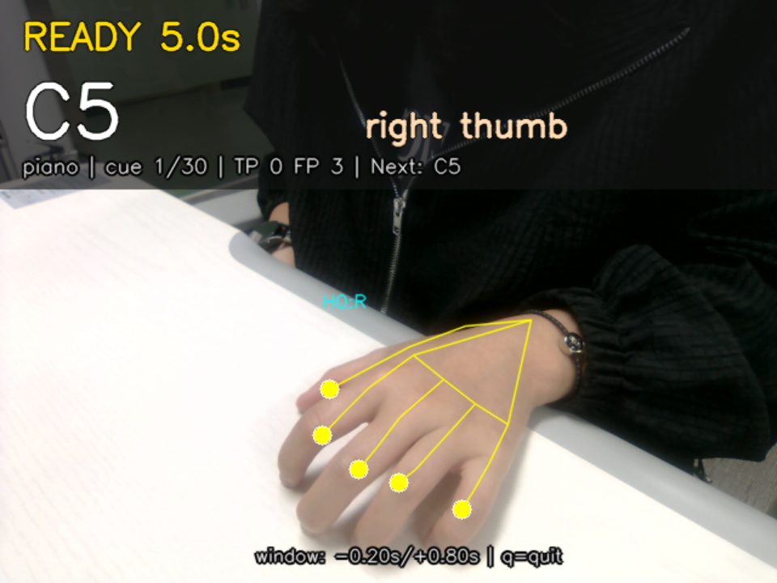
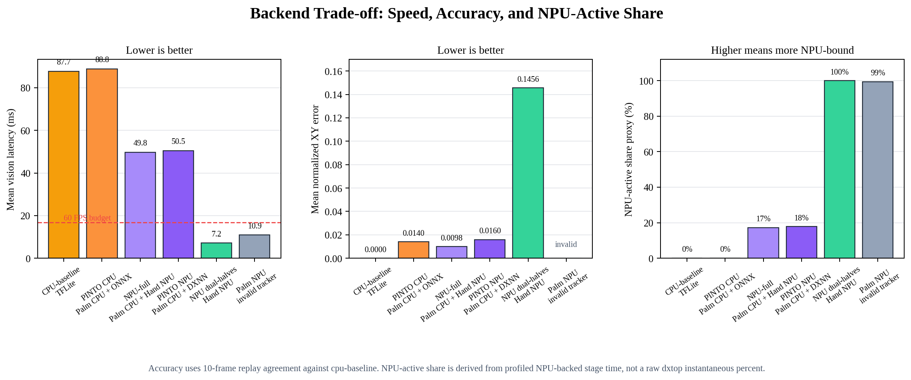

# PANDA: <u><strong>P</strong></u>ose-<u><strong>A</strong></u>ware <u><strong>N</strong></u>PU-Driven <u><strong>D</strong></u>igital <u><strong>A</strong></u>udio Interface for Contactless Musical Performance


<p align="center"><em>PANDA project icon.</em></p>

**Acronym expansion:** <u><strong>P</strong></u>ose-<u><strong>A</strong></u>ware <u><strong>N</strong></u>PU-Driven <u><strong>D</strong></u>igital <u><strong>A</strong></u>udio Interface

**Final Report**

**Authors:** FILLME

**Affiliation:** FILLME

**Date:** 2026-06-16

**Code availability:** Not publicly released.

---

## Abstract

This report presents **PANDA**, short for <u><strong>P</strong></u>ose-<u><strong>A</strong></u>ware <u><strong>N</strong></u>PU-Driven <u><strong>D</strong></u>igital <u><strong>A</strong></u>udio Interface, a real-time camera-based musical interface that converts hand and finger motions into playable drum and piano events. The system tracks hand landmarks from a USB camera, estimates downward fingertip velocity and finger-joint angular velocity, and triggers audio only when both motion cues indicate an intentional strike. Two musical modes are implemented on the same perception-and-strike-detection core: (1) a **drum pad mode**, where any fingertip may strike an on-screen rectangular pad, and (2) a **piano mode**, where notes are mapped to hand and finger identity. The final piano default layout maps the left hand from thumb to pinky as `G4, F4, E4, D4, C4` and the right hand as `C5, D5, E5, F5, G5`. The implementation supports CPU MediaPipe, CPU TFLite baseline, hybrid CPU+NPU MediaPipe hand-landmark inference, experimental PINTO ONNX CPU inference, and experimental PINTO DXNN NPU inference. Evaluation utilities and unit tests validate strike detection, pad-zone parsing, piano-note mapping, ROI transforms, CLI defaults, and benchmark helpers. Prototype measurements show that the valid `npu-full` pipeline reduces hand-landmark time from about 44.8 ms on CPU TFLite to about 9.1 ms on NPU, while the newly compiled `pinto-npu` path runs the PINTO hand landmark stage at about 9.0 ms in the same palm/ROI pipeline. End-to-end accurate paths remain dominated by CPU palm detection at about 40 ms. A palm-detection `.dxnn` path runs quickly and uses the NPU, but currently produces no accepted palm detections in the benchmark pipeline and therefore cannot yet be treated as a working full-NPU tracker. The project demonstrates a practical path toward low-cost, contactless musical instruments on edge AI hardware, with clear remaining work in palm-detector deployment, end-to-end audio-latency measurement, robust hit-accuracy evaluation, and user studies.

**Keywords:** PANDA, contactless musical interface, hand tracking, gesture recognition, air drums, virtual piano, edge AI, NPU, real-time interaction

---

## 1. Introduction

Musical performance interfaces traditionally rely on physical contact: a drumstick contacts a drumhead, or a finger depresses a piano key. Contact provides both tactile feedback and a clear sensing event. However, camera-based hand tracking makes it possible to build **contactless musical instruments** that require no specialized controller beyond a camera and display. Such systems are attractive for prototyping, education, accessibility, public installations, and embedded AI demonstrations.

The main challenge is that visually recognizing a musical strike is harder than recognizing a static hand pose. A simple fingertip-position trigger produces false positives when the whole hand moves, while a simple velocity trigger may fire during non-musical gestures. PANDA addresses this by combining two motion cues:

1. **Fingertip downward velocity**: the fingertip moves rapidly in the image direction associated with a striking motion.
2. **Finger-joint angular velocity**: the finger itself articulates, distinguishing a deliberate finger strike from arm-only translation.

This report summarizes the final implemented system, its two musical modes, generated visual assets, software architecture, testing strategy, and prototype performance measurements.

### 1.1 Contributions

The implemented project contributes:

- A real-time hand-landmark musical interface supporting both **drum pad** and **piano** modes.
- A common strike detector using fingertip velocity plus joint angular velocity.
- A pad-zone drum interface with configurable rectangular hit regions and visual flash feedback.
- A piano interface with a corrected default mapping: left thumb `G4`, left pinky `C4`, right hand `C5–G5`.
- A mirrored selfie-view display and guided-style windowed skeleton overlay, enabled by default, so the performer's left/right hand motion and visual feedback match the guided evaluator.
- Generated interface diagrams for both modes.
- A default `main.py` runtime that launches the final `npu-full` CPU+NPU model path when packaged models are available.
- Experimental `pinto-cpu` and `pinto-npu` backends using the PINTO sparse hand-landmark model for CPU ONNX and DEEPX DXNN adoption testing [6], [7].
- A measured characterization of the experimental palm-detection `.dxnn` path, including NPU utilization and the current failure mode where no accepted palms are produced.
- Report figures generated programmatically for system architecture, strike logic, and backend latency.
- A repeatable validation pipeline covering mapping, detector behavior, pad validation, ROI helpers, and benchmark helpers.

---

## 2. System Overview

Figure 1 summarizes the runtime pipeline. Frames are captured from a USB camera using an OpenCV-based capture layer [3], processed by one of several hand-tracking backends, converted into per-hand landmark coordinates, passed to the strike detector, mapped to either piano notes or drum pad sounds, and finally played through pre-rendered PCM audio buffers.


<p align="center"><em>Figure 1. Runtime pipeline diagram generated programmatically for this report.</em></p>

The same vision pipeline and strike detector support both musical modes. The mapping layer changes according to mode:

- **Piano mode:** `hand_id × fingertip_id → note name`.
- **Drum mode:** `fingertip position inside pad rectangle → drum sound`.

### 2.1 Implemented Modes

#### Drum Pad Mode

Drum mode no longer uses a fixed per-finger drum mapping. Instead, it uses normalized on-screen rectangles. Any tracked fingertip can play a pad if the strike detector fires while the fingertip is inside that pad. The default layout has eight pads: kick, snare, hat, ride, tom_l, tom_m, crash, and clap.


<p align="center"><em>Figure 2. Default drum pad layout generated programmatically for this report.</em></p>

A larger diagram lists all built-in drum sound keys available for custom pad layouts.


<p align="center"><em>Figure 3. Built-in drum sound-key catalog generated programmatically for this report.</em></p>

#### Piano Mode

Piano mode maps fingers to notes. The final default layout is:

| Hand | Thumb | Index | Middle | Ring | Pinky |
|------|-------|-------|--------|------|-------|
| Left / Hand 0 | G4 | F4 | E4 | D4 | C4 |
| Right / Hand 1 | C5 | D5 | E5 | F5 | G5 |

This preserves the user's intended left-hand orientation: the **left thumb is G4** and the **left pinky is C4**, while the right hand remains ascending from C5 to G5.


<p align="center"><em>Figure 4. Default piano layout generated programmatically for this report.</em></p>

A custom JSON piano layout example is also generated using the same default slot order.


<p align="center"><em>Figure 5. Piano custom-layout example generated programmatically for this report.</em></p>

### 2.2 Live Interface Screenshots

Live screenshots were captured from the normal, non-guided runtime after the mirror-view and full-camera overlay updates. The non-guided interface uses the same full-camera overlay style as the guided evaluator, but removes cue-specific guidance such as countdowns and "ready" prompts. The drum screenshot shows the pad-based performance interface with a mirrored camera feed, fingertip landmark overlays, and recent strike feedback. The piano screenshot shows the live hand-to-note interface with recent strike feedback overlaid on the camera view.



<p align="center"><em>Figure 6. Non-guided drum-pad runtime screenshot captured from the mirrored CPU+NPU interface.</em></p>



<p align="center"><em>Figure 7. Non-guided piano runtime screenshot captured from the mirrored CPU+NPU interface.</em></p>

---

## 3. Background and Related Work

PANDA sits at the intersection of gesture-based musical interfaces, real-time hand tracking, and embedded edge AI. Prior gesture instruments often use depth cameras, wearable sensors, inertial measurement units, or vision-based pose estimation. Compared with wearable sensors, camera-only systems reduce setup cost and improve accessibility, but they must infer intent from noisy visual motion alone.

This project uses a hand-landmark approach similar to modern single-camera hand-pose systems such as MediaPipe Hands [1] and the MediaPipe Hand Landmarker task [2]: a palm or hand detector localizes the hand, a landmark network estimates keypoints, and application logic derives gestures from keypoint dynamics. The project also investigates CPU/NPU deployment trade-offs, because low-latency musical interaction requires both accurate perception and rapid audio response.

The implementation is intentionally modular: hand tracking can be swapped across backends, while strike detection and sound mapping remain independent of the model runtime.

---

## 4. Methods

### 4.1 Hand-Landmark Representation

Each detected hand is represented by 21 normalized landmarks. The application uses five fingertip indices:

| Finger | Landmark index |
|--------|----------------|
| Thumb | 4 |
| Index | 8 |
| Middle | 12 |
| Ring | 16 |
| Pinky | 20 |

For each fingertip, a three-point chain is selected for angular motion. For example, the index finger uses MCP-PIP-TIP landmarks. The thumb uses a thumb-specific chain involving the IP joint.

### 4.2 Strike Detection

A strike is emitted only when two independent conditions hold at the same time. Figure 8 shows the decision logic.


<p align="center"><em>Figure 8. Strike-decision logic diagram generated programmatically for this report.</em></p>

Let \(y_t\) be the fingertip's normalized vertical image coordinate at time \(t\). The downward fingertip velocity is approximated by

\[
v_y = \frac{y_t - y_{t-1}}{t - t_{t-1}}.
\]

Because image coordinates increase downward, positive \(v_y\) indicates downward motion. Let \(\theta_t\) be the angle at the selected finger joint. Joint angular speed is approximated by

\[
\omega = \left|\frac{\theta_t - \theta_{t-1}}{t - t_{t-1}}\right|.
\]

A strike candidate satisfies

\[
v_y \ge \tau_v \quad \land \quad \omega \ge \tau_\omega.
\]

The detector then applies confidence filtering, minimum displacement filtering, and cooldown logic. The middle finger has a lower internal threshold scale because its visual angular change is often smaller than the other fingers in camera coordinates.

### 4.3 Drum Pad Mapping

Each drum pad is a normalized rectangle

\[
(x_1, y_1, x_2, y_2), \quad 0 \le x_1 < x_2 \le 1, \quad 0 \le y_1 < y_2 \le 1.
\]

If a fingertip strike occurs and the fingertip coordinate lies inside a pad, the detector returns that pad's sound key. Cooldown is tracked by pad label, allowing different pads to be played in rapid sequence.

Custom drum layouts are loaded from JSON:

```json
{
  "pads": [
    {"label": "kick", "sound": "kick", "x1": 0.05, "y1": 0.35, "x2": 0.29, "y2": 0.59, "color": [80, 80, 180]}
  ]
}
```

### 4.4 Piano Mapping

Piano mapping uses a 10-slot tuple ordered as:

```text
[Hand 0 thumb, index, middle, ring, pinky,
 Hand 1 thumb, index, middle, ring, pinky]
```

The final default tuple is:

```python
("G4", "F4", "E4", "D4", "C4", "C5", "D5", "E5", "F5", "G5")
```

This mapping is implemented as the default runtime note configuration and is mirrored in the custom piano-layout configuration used to generate the example figure.

### 4.5 Audio Generation

The system pre-renders synthetic drum and piano sounds into `pygame.mixer.Sound` objects [4] to avoid synthesizing audio on every strike. Piano tones are approximately 0.5 seconds long. Short drum samples were lengthened so triggered sounds remain audible despite perception and output latency.

---

## 5. Implementation

### 5.1 Runtime Backends

The application supports several backend configurations, including MediaPipe-based CPU inference [1], [2], DEEPX `.dxnn` NPU execution through the DXNN toolchain [5], and experimental PINTO CPU/NPU backends [6], [7].

| Backend | Palm detection | Hand landmarks | Intended use |
|---------|----------------|----------------|--------------|
| `cpu` | MediaPipe internal [1], [2] | MediaPipe internal [1], [2] | Simple CPU-only baseline |
| `cpu-baseline` | CPU TFLite | CPU TFLite | Comparable pipeline without NPU |
| `npu-full` | CPU TFLite | NPU `.dxnn` | Accurate palm pipeline with NPU hand inference; default `main.py` runtime |
| `npu-full --palm-dxnn ...` | NPU `.dxnn` | NPU `.dxnn`, if palms are accepted | Experimental full-NPU path; currently invalid because no accepted palms are produced |
| `npu` | none / dual-halves approximation | NPU `.dxnn` | Fastest low-latency approximation |
| `pinto-cpu` | CPU TFLite | PINTO ONNX on CPU | Adoption experiment for the PINTO sparse hand-landmark model |
| `pinto-npu` | CPU TFLite | PINTO DXNN on NPU | Adoption experiment for the compiled PINTO sparse hand-landmark model |

The default `npu-full` path is architecturally preferred for accurate hand localization and is the default runtime used by `main.py` when the packaged model files are present. In the final implementation, landmark correction is **off by default** because the latest replay benchmark showed that the available correction profiles worsened the right-hand aggregate error. Correction remains available as an explicit opt-in for controlled experiments. CPU palm detection still dominates latency. The dual-halves NPU mode is faster because it removes palm detection, but it is a geometric approximation and should be evaluated under the target camera setup. The experimental palm-detection `.dxnn` path proves that palm inference can execute on the NPU, but its current output/postprocess behavior prevents accepted detections and skips the hand-landmark stage.

### 5.2 User Interface

The runtime display contains the camera feed, hand/finger landmark overlays, and mode-specific overlays. The camera feed is mirrored by default, producing a selfie-style interface in which moving a hand leftward in physical space also moves it leftward on the screen. This small interface detail is important for playability: without the mirror flip, the performer must mentally invert left/right motion while aiming at drum pads or piano cues. A `--no-mirror` option remains available for camera setups that already provide mirrored input.

In drum mode, rectangles are drawn directly on the mirrored camera feed and flash briefly when hit; hit testing uses the same display-transformed landmark coordinates, so pad locations match what the performer sees. In piano mode, the note mapping is tied to a mirror-aware physical left/right estimate rather than raw tracker hand order or raw MediaPipe handedness. This keeps the user-specified left-hand and right-hand note ranges stable even when the camera feed is flipped for the performer and even when the hand tracker changes the order of detected hands.

The live interface draws per-finger landmark overlays for operator feedback while strike detection evaluates every fingertip internally. Piano note triggering uses the model-provided fingertip landmark identity together with a mirror-aware physical left/right hand estimate.

The generated diagrams are used as report figures and as reference assets for documenting the available mappings.

---

## 6. Experimental Methodology

### 6.1 Software Validation

The validation suite performs Python syntax checks, unit tests, and palm decode tests. Hardware-dependent benchmark smoke tests are separated from the default quality gate so that the report can distinguish portable software validation from board-specific performance evaluation.

### 6.2 Backend Latency Measurement

The backend evaluation was designed to separate three questions that are often conflated in a real-time vision instrument:

1. How fast is a simple CPU-only hand-tracking baseline?
2. How much of the latency comes from palm detection versus hand landmark inference?
3. Does the NPU accelerate the part of the pipeline that is actually deployed on the NPU, and what accuracy risks are introduced by faster approximations?

For that reason, several runtime configurations were evaluated rather than a single prototype.

| Configuration | What it evaluates | Why this baseline is required |
|---------------|-------------------|-------------------------------|
| `cpu` / MediaPipe | End-to-end CPU reference using MediaPipe's built-in palm and hand stack | Establishes the simplest robust baseline and verifies that the musical logic works without model-conversion dependencies |
| `cpu-baseline` | Palm TFLite + hand landmark TFLite, both on CPU | Uses the same two-stage palm→ROI→hand structure as `npu-full`, so it isolates whether replacing only hand inference with NPU is beneficial |
| `npu-full` | Palm TFLite on CPU + hand landmark `.dxnn` on NPU | Tests the intended accurate hybrid edge-AI pipeline while preserving reliable float32 palm detection |
| `npu-full --palm-dxnn ...` | Palm `.dxnn` on NPU + hand landmark `.dxnn` on NPU if a palm is accepted | Tests the desired full-NPU direction and exposes the current palm-detection failure mode |
| `npu` dual-halves | No palm detector; screen split into two approximate hand regions; hand landmark `.dxnn` on NPU | Estimates the low-latency lower bound when palm detection is removed, useful for live demos but less robust to hand placement |
| `pinto-cpu` | Palm TFLite on CPU + PINTO sparse hand landmark ONNX on CPU | Tests whether the PINTO hand-landmark model can be adopted before a `.dxnn` compile is available |
| `pinto-npu` | Palm TFLite on CPU + PINTO sparse hand landmark DXNN on NPU | Tests the off-board-compiled PINTO hand model inside the same palm/ROI pipeline |

The main evaluation metric in this report is **vision-loop latency**: time spent in camera-frame processing, palm/hand inference, ROI handling, and landmark production before the audio trigger logic. This is not a full acoustic end-to-end latency measurement. The target interactive frame budget is 16.7 ms for 60 FPS, while the final acoustic measurement should separately report motion-to-sound latency.

The hardware/software environment for the recorded prototype measurements was:

| Item | Value |
|------|-------|
| Board | Orange Pi 5 Plus (RK3588, aarch64) |
| OS / Python | Linux, Python 3.10.12 |
| DX-RT / `dx_engine` [5] | DXRT v3.2.0 observed through `dxrt-cli`; NPU driver v2.1.0; firmware v2.5.0 |
| DX-COM [5] | Existing MediaPipe `.dxnn` compiled with v2.1.0-rc.4 metadata; PINTO `.dxnn` compiled off-board with DX-COM 2.3.0-rc.5 metadata |
| Camera | USB camera, 640×480 |
| Offline dataset | 90 captured frames in `dataset/frame_*.png` |

The palm detector was also tested as an NPU `.dxnn` candidate. The NPU palm model is fast, with repeated dataset runs around 8-11 ms, and `dxtop` showed visible NPU use during the palm-NPU load. However, the benchmark profile consistently reported `hand=0.00 ms`, meaning no palm passed the current detection acceptance path and the hand-landmark model was never invoked. A tensor-level diagnostic separated the failure boundary: TFLite and ONNX outputs matched almost exactly on `dataset/frame_000.png` (score correlation approximately 1.0, box correlation approximately 1.0), while DXNN scores were anti-correlated with the TFLite reference (score correlation -0.1457) and the best TFLite anchor score dropped from `+1.8786` to `-29.3477` in DXNN. DXNN metadata reports `[1,192,192,3] uint8` input, and testing NHWC/NCHW plus uint8/float32 input variants did not recover detections. Therefore, all accurate palm-based configurations use CPU TFLite palm detection, and palm detection remains the main latency bottleneck.


<p align="center"><em>Figure 9. Backend latency comparison generated programmatically for this report.</em></p>

### 6.3 Required Manual Measurements

A complete academic evaluation still requires manual measurements of the physical interaction loop. The protocols are defined here so that the missing data can be inserted directly into this report rather than stored only in auxiliary notes.

1. **End-to-end audio latency:** record the performer's hand and the speaker output simultaneously using a high-speed camera or synchronized audio/video setup. For each strike, identify the video frame where the downward hit begins and the first audio waveform onset at the speaker. Compute `Delta t = t_audio - t_video`. Use at least 30 strikes per mode and report mean, standard deviation, and P95 latency.
2. **Hit accuracy:** run guided trials in both drum and piano modes using the built-in visual/audio cue evaluator. The evaluator displays a predefined beat sequence, records detected strike events, matches events to scheduled cues, and exports `cues.csv`, `events.csv`, `matches.csv`, `summary.json`, `summary.md`, and an optional review video. A true positive is an intended strike detected within the allowed time window. A false negative is an intended strike with no valid event. A false positive is an unintended or duplicate event outside the allowed window. The pilot guided results are reported in Section 7.3.
3. **Per-run logging:** retain the internal build identifier, backend, camera resolution, model checksums, `vy_trigger`, `joint_dps`, `cooldown`, lighting conditions, and raw event log fields such as `t`, `frame_id`, `infer_ms`, `hand_id`, `finger_id`, `pad/note`, and `trigger`.

---

## 7. Results

### 7.1 Functional Results

The implementation satisfies the main functional goals:

- Detects hand landmarks from live camera input.
- Detects intentional strikes using fingertip and joint dynamics.
- Plays piano notes from hand/finger identity.
- Plays drum sounds from on-screen rectangular pad hits.
- Supports custom piano-note JSON and drum-pad JSON layouts.
- Shows generated mapping diagrams in documentation and runtime overlays.

### 7.2 Current Test Results

The latest validation run produced:

| Test group | Result |
|------------|--------|
| Python syntax check | Passed |
| Unit tests | 49/49 passed |
| Palm decode tests | 15/15 passed |
| Dataset benchmark smoke | Skipped intentionally in the portable validation run |

The unit tests cover default piano mapping, synthetic audio duration, pad-zone generation, pad JSON validation, instrument slot validation, strike detector thresholds, middle-finger sensitivity, cooldown behavior, ROI helpers, benchmark helper functions, backend CLI defaults, dataset capture indexing, and the guided evaluation cue/matching/output helpers.

### 7.3 Guided Live Evaluation Results

A guided live evaluation was run on May 27, 2026 using the mirrored camera interface and the final `npu-full` architecture: CPU palm detection with NPU hand-landmark inference. To reduce the effect of reading and reaction time, the evaluator used a block-repetition protocol. Each target block had a 5 s initial lead-in, a 6 s ready interval before the target, six repeated strikes at 50 BPM, and the first two strikes of each block were excluded from scoring as warm-up beats. Matching used a -0.20 s / +0.80 s cue window and a 0.35 s global event cooldown to reduce duplicate multi-finger detections.

An initial two-hand piano guided run remained nearly unusable, with only 7.5% recall / target accuracy. Therefore, the final piano guided evaluation used a one-hand right-hand protocol covering only `C5–G5`, with the tracker limited to one hand. This restriction directly targets the observed failure mode where simultaneous two-hand piano tracking produced unstable finger identity and very low note accuracy.

Figures 10 and 11 show the guided evaluator UI used for this measurement. Unlike the normal runtime screenshots in Section 2.2, these screens include the current cue, readiness countdown, cue index, target hint, and the accepted matching window.



<p align="center"><em>Figure 10. Guided drum evaluation screenshot showing the current pad cue and mirrored pad overlay.</em></p>



<p align="center"><em>Figure 11. Guided piano evaluation screenshot showing the current note cue and suggested finger.</em></p>

| Mode | Scored cues | TP | FP | FN | Precision | Recall / target accuracy | Mean cue-to-detection latency |
|------|------------:|---:|---:|---:|----------:|-------------------------:|------------------------------:|
| Drum pads | 32 | 11 | 106 | 21 | 9.4% | 34.4% | 333 ms |
| Piano, two hands (diagnostic) | 40 | 3 | 79 | 37 | 3.7% | 7.5% | 291 ms |
| Piano, right hand only | 20 | 3 | 32 | 17 | 8.6% | 15.0% | 304 ms |


<p align="center"><em>Figure 12. Guided evaluation plot generated from the mirrored `npu-full` block-repetition drum, two-hand piano, and one-hand piano runs.</em></p>

The drum-pad interface performed better than the piano interface because drum mode only requires the fingertip strike to land inside a visible rectangle, while piano mode requires stable hand side and finger identity. The two-hand piano diagnostic run confirms this difficulty: many strikes were detected, but most did not match the prompted note. Restricting piano evaluation to one right hand improved target accuracy from 7.5% to 15.0%, but the absolute value remains low and indicates that finger identity, mirrored-hand interpretation, and duplicate-strike suppression need more work. The cue-to-detection latency values include human reaction time and should not be interpreted as acoustic motion-to-speaker latency.

### 7.4 Backend Performance Summary

The table below reports the high-level latency comparison for the evaluated runtime configurations. The `cpu` row is a practical reference path. The `cpu-baseline` and default `npu-full` rows form the controlled CPU-vs-NPU comparison because they share the same palm→ROI→hand pipeline and differ primarily in hand landmark inference. The PINTO rows are 10-frame adoption smokes for the newly added PINTO ONNX/DXNN paths. The `npu-full --palm-dxnn` row is not a valid hand-tracking result; it is included because it directly measures the desired palm-on-NPU direction and shows why it is not yet usable.

| Backend | Recorded latency / profile | Interpretation |
|---------|----------------------------|----------------|
| `cpu` (MediaPipe) | about 35 ms in prior live-oriented measurement | Simple CPU-only functional baseline; no extra model files required |
| `cpu-baseline` (TFLite) | mean 84.40 ms; palm 39.26 ms + hand 44.80 ms | Same two-stage structure as `npu-full`; isolates the hand-landmark accelerator comparison |
| `npu-full` default | mean 50.10-50.32 ms; palm about 40.7 ms + hand about 9.1 ms | Valid accurate hybrid path; NPU accelerates hand landmarks, but CPU palm detection dominates total time |
| `npu-full --palm-dxnn models/vendor/palm_detection_lite.dxnn` | repeated means 10.39 ms and 10.88 ms; profile `hand=0.00 ms` | Palm `.dxnn` executes and is fast, but current output/postprocess path accepts no palms, so this is not a working full-NPU tracker |
| `npu` dual-halves | 10-frame replay mean 7.16 ms; about 16 ms in prior live-oriented measurement | Fastest path and close to the 60 FPS budget, but it approximates hand location without palm detection |
| `pinto-cpu` | 10-frame smoke mean 88.91 ms; palm 40.19 ms + hand 48.27 ms | PINTO ONNX adoption works on CPU, but it is slower than the current NPU hand-landmark path |
| `pinto-npu` | 10-frame smoke mean 50.48 ms; palm 41.21 ms + hand 9.00 ms | PINTO DXNN loads and runs on NPU; latency is comparable to `npu-full`, but accuracy is not yet a default-path win |

The result has three important implications. First, moving only the hand landmark model to NPU helps substantially, reducing the TFLite-style hand stage from 44.80 ms to about 9.13 ms. Second, this is still insufficient when CPU palm detection remains about 40 ms. Third, the palm `.dxnn` path consumes NPU and is fast, but it cannot be used for the final instrument until its detections are accepted and the hand-landmark stage runs.

The following table compares the same backend family across three practical axes: speed, landmark agreement, and NPU use. To keep `cpu-baseline`, `pinto-cpu`, `npu-full`, `pinto-npu`, `npu` dual-halves, and palm-NPU rows in one comparable window, this table uses the 10-frame replay smoke measurements; the longer 90-frame `cpu-baseline` vs. `npu-full` result remains the main matched benchmark in Section 7.5. The NPU column is a profiled **NPU-active share proxy**, computed as the fraction of measured vision-loop time spent in NPU-backed stages. It is not a raw instantaneous `dxtop` percentage; it is included because `dxtop` showed bursty use while the profiler gives a reproducible per-frame estimate.

| Backend | Mean latency | FPS equivalent | NPU-active share proxy | Mean landmark error vs. `cpu-baseline` | Practical conclusion |
|---------|-------------:|---------------:|-----------------------:|---------------------------------------:|----------------------|
| `cpu-baseline` | 87.73 ms | 11.4 FPS | 0.0% | 0.0000 reference | Accuracy reference, but too slow and no NPU use |
| `pinto-cpu` | 88.85 ms | 11.3 FPS | 0.0% | 0.0140 | PINTO ONNX works, but has no speed advantage |
| `npu-full` | 49.76 ms | 20.1 FPS | 17.2% | 0.0099 | Best current NPU-backed accuracy and default backend |
| `pinto-npu` | 50.48 ms | 19.8 FPS | 17.8% | 0.0160 | Runs at NPU speed, but does not beat `npu-full` accuracy |
| `npu` dual-halves | 7.16 ms | 139.7 FPS | about 100% | 0.1456 | Fastest and most NPU-bound, but too inaccurate for the final tracker |
| `npu-full --palm-dxnn` | 10.88 ms | 91.9 FPS | 99.4% | not valid | Palm NPU executes, but no accepted palms reach hand landmark inference |



<p align="center"><em>Figure 13. Backend trade-off comparison across latency, landmark agreement, and NPU-active share.</em></p>

From this three-axis view, the current answer is clear: `pinto-npu` proves that the PINTO model can run on the NPU, but it does not beat `npu-full` overall. Their latency and NPU-active share are almost the same because both still spend about 40 ms in CPU palm detection. The differentiator is landmark agreement, where `npu-full` is better in the current 10-frame replay comparison. The only backend that is much faster, `npu` dual-halves, loses too much accuracy because it removes palm localization.

### 7.5 Offline Dataset Benchmark Summary

A 90-frame offline benchmark was run to compare the two structurally matched pipelines, `cpu-baseline` and `npu-full`, using the same captured input frames. This benchmark removes live camera variability and focuses on per-frame processing latency and landmark agreement. PINTO CPU/NPU rows are reported separately as 10-frame smoke measurements because the compiled PINTO `.dxnn` was added after the main 90-frame run.

| Configuration | Mean latency | P95 latency | Component profile | Interpretation |
|---------------|-------------:|------------:|-------------------|----------------|
| `cpu-baseline`, palm every frame | 84.40 ms | 86.78 ms | palm 39.26 ms + hand 44.80 ms | CPU TFLite reference for the two-stage pipeline |
| `npu-full`, palm every frame | 50.32 ms | 54.52 ms | palm 40.93 ms + hand 9.13 ms | Same palm/ROI path, but hand inference is moved to NPU |
| `npu-full`, repeated 5-run measurement | 50.10 ms | 51.71 ms | palm 40.69 ms + hand 9.12 ms | Confirms the stable default CPU-palm + NPU-hand profile |
| `npu-full --palm-dxnn`, repeated run 1 | 10.39 ms | 12.84 ms | palm 10.34 ms + hand 0.00 ms | Palm NPU path runs, but no accepted palms reach the hand stage |
| `npu-full --palm-dxnn`, repeated run 2 | 10.88 ms | 13.13 ms | palm 10.82 ms + hand 0.00 ms | Same failure mode reproduced |
| `pinto-cpu` (10-frame smoke) | 88.91 ms | 97.13 ms | palm 40.19 ms + hand 48.27 ms | PINTO ONNX CPU path is functional but not a latency win |
| `pinto-npu` (10-frame smoke) | 50.48 ms | 54.48 ms | palm 41.21 ms + hand 9.00 ms | PINTO DXNN path is functional and accelerates the PINTO hand stage |
| `npu-full`, `--palm-redetect-every 5` (20-frame smoke) | 15.29 ms | 50.96 ms | palm frames 3/20, tracking frames 17/20 | Shows latency potential of palm skipping, but drift and hit accuracy must be verified |
| `npu-full`, `--async-palm` smoke | 10-20 ms range | input-pacing dependent | tracking with asynchronous palm refresh | Experimental path; live stability still needs validation |

The matched `cpu-baseline` vs. `npu-full` comparison shows that the NPU substantially reduces hand-landmark time in the TFLite-style pipeline (44.80 ms to 9.13 ms in the recorded 90-frame run). However, palm detection remains about 40 ms, so the accurate pipeline still exceeds the 60 FPS target unless palm frequency is reduced or palm detection is accelerated.

Landmark accuracy was estimated by comparing `npu-full` landmarks against the CPU-baseline reference in normalized image coordinates. The latest default is the uncorrected NPU landmark output; correction is no longer applied automatically.

| Hand | Mean error over 21 points | Mean fingertip error | Mean max error | Worst max error |
|------|--------------------------:|---------------------:|---------------:|----------------:|
| Right | 0.0220 | 0.0267 | 0.0439 | 0.1316 |
| Left | 0.0151 | 0.0225 | 0.0304 | 0.0547 |

Two correction approaches were tested. The dataset correction worsened the right-hand mean error to 0.0314, and a bias correction worsened the right-hand mean error to 0.0290 while only slightly improving some left-hand values. Because this trade-off is not robust, the runtime default was changed to leave landmark correction disabled. Correction remains available as an explicit experimental option when a controlled calibration set is available.

The current conclusion is that the hand-landmark `.dxnn` is callable and correctly wired at the IO level, but its INT8 output distribution differs enough from the CPU float/TFLite reference to affect visible landmark accuracy. This is a model-conversion and quantization quality issue rather than a total runtime failure.

The PINTO sparse hand-landmark model was also evaluated as an adoption candidate [6], [7]. The CPU ONNX path works, and an off-board DX-COM compile produced `models/vendor/pinto_hand_landmark_sparse.dxnn` with SHA-256 `8f35a014f9908f210a71edbba3808bb4940a2ca60ee3b45166bafac5aabdeccb`. Board-side DXRT reported input `input [1,224,224,3] uint8` and outputs `xyz_x21`, `hand_score`, and `lefthand_0_or_righthand_1`; the original ONNX `Round` operation had to be replaced with `Identity`, so the handedness output is a sigmoid probability thresholded at `0.5`.

In a 10-frame replay comparison against `cpu-baseline`, the PINTO paths produced the following landmark agreement:

| Backend | Hand | Mean error over 21 points | Mean fingertip error | Mean max error | Worst max error |
|---------|------|--------------------------:|---------------------:|---------------:|----------------:|
| `pinto-cpu` | Right | 0.0176 | 0.0145 | 0.0321 | 0.0330 |
| `pinto-cpu` | Left | 0.0103 | 0.0064 | 0.0198 | 0.0208 |
| `pinto-npu` | Right | 0.0205 | 0.0313 | 0.0429 | 0.0441 |
| `pinto-npu` | Left | 0.0115 | 0.0140 | 0.0278 | 0.0285 |
| `npu-full` | Right | 0.0068 | 0.0100 | 0.0133 | 0.0154 |
| `npu-full` | Left | 0.0129 | 0.0178 | 0.0264 | 0.0308 |

The model is therefore useful as an experimental candidate and runs at NPU speed, but it is not yet a replacement for the default hand-landmark `.dxnn`.

---

## 8. Discussion

### 8.1 Why Two Motion Cues Matter

A virtual instrument should not trigger whenever a hand moves. The combined velocity-and-angle criterion improves musical intent detection because it requires the fingertip to move downward and the finger to articulate. This is especially important in piano mode, where individual finger identity matters, and in drum mode, where the same fingertip can cross pad boundaries during normal movement.

### 8.2 Drum Pad Mode vs. Per-Finger Drum Mapping

The project originally used per-finger drum mapping. The final drum interface uses rectangular pads instead, which is more intuitive because it resembles a physical drum pad controller. It also lets the performer use any finger for any drum sound. The trade-off is that pad layout now depends on camera framing and screen coordinates, so calibration and visual feedback become more important.

### 8.3 Piano Mapping Convention

The final piano mapping follows the user-specified convention: left-hand thumb is highest among left-hand notes (`G4`) and left-hand pinky is lowest (`C4`), while the right hand ascends from `C5` to `G5`. This mapping matches common left-hand physical intuition when the left hand is viewed in a camera-facing diagram.

### 8.4 Edge AI Trade-Offs

The NPU accelerates hand landmark inference, but a full robust pipeline also needs palm detection. In the experiments reported above, the NPU palm candidate was fast and used the NPU visibly, but it was unusable as a tracker because no accepted palms reached the hand landmark stage. The latest tensor diagnostic indicates that the TFLite-to-ONNX export and palm decoder are correct; the failure appears after DX-COM compilation, where the INT8 DXNN score head is shifted deeply negative and loses the TFLite score ranking. Consequently, the most accurate `npu-full` backend keeps CPU TFLite palm detection, and total latency is dominated by that CPU palm stage. This suggests that future work should focus on recompiling or replacing the palm detector, improving calibration for the palm score head, or reducing palm frequency while controlling drift.

The PINTO sparse hand-landmark model is a plausible adoption candidate because both CPU ONNX and DEEPX DXNN versions are now runnable in the same application path [6], [7]. The main compiler caveat is that the original dynamic and fixed-shape ONNX variants failed DX-COM lowering because `onnx.Round` was unsupported; replacing the final handedness `Round` with `Identity` allowed compilation, with the runtime applying a `>=0.5` threshold. The SNU compile server at `43.203.143.33:443` timed out during this session, and local compilation on the Orange Pi was not practical because the available DX-COM package path targets `x86_64/amd64` while the board is `aarch64` [5], [9]. The successful compile was performed on an x86_64 Ubuntu PC and then transferred to the board. The STMicro native-INT8 hand-landmarks model is still a candidate for future testing, but it has the same practical requirement: it must be compiled to a DEEPX-compatible `.dxnn` before it can be used on the NPU [8].

---

## 9. Limitations

The current prototype has several limitations:

- **No complete final E2E audio-latency measurement** is included; a manual high-speed-camera or synchronized audio/video experiment is required.
- **No formal user study** has been conducted.
- **Guided hit-accuracy results are preliminary**: the pilot run has one performer and one slow tempo, and piano accuracy remains low without further calibration.
- **Depth ambiguity** remains because the system uses a single RGB camera.
- **Lighting and background sensitivity** may affect landmark stability.
- **NPU-full latency** remains limited by CPU palm detection in the valid default path.
- **Palm detection on NPU is not yet valid**: the palm `.dxnn` path is fast and uses NPU, but currently produces no accepted palms in the benchmark path.
- **Hand-landmark NPU accuracy is still below the CPU reference** in some cases due to INT8 output drift, and automatic correction is not robust enough to enable by default.
- **PINTO NPU is experimental rather than default**: the compiled `.dxnn` loads and runs, but the small replay comparison does not justify replacing `npu-full`.
- **Tactile feedback is absent**, so timing may feel different from physical instruments.

---

## 10. Future Work

Recommended next steps are:

1. Recompile or replace the palm detector so the NPU palm path produces accepted detections and nonzero hand-stage time; current evidence points to DX-COM INT8 score-head degradation rather than TFLite export, ONNX runtime, decoder, or input-layout error.
2. Expand the `pinto-npu` benchmark beyond the 10-frame smoke test and evaluate whether calibration or threshold tuning can make it competitive with the default hand-landmark `.dxnn`.
3. Re-test the STMicro native-INT8 hand-landmarks model after a working compile route exists.
4. Measure E2E audio latency using a high-speed camera and synchronized audio waveform.
5. Run guided hit-accuracy trials for both modes at multiple tempos.
6. Improve piano-specific calibration for finger identity, screen-side hand mapping, and per-user strike thresholds.
7. Add per-user calibration for pad positions, handedness, and strike thresholds.
8. Add optional MIDI output so the system can drive external instruments.
9. Expand the guided evaluation to more participants and longer randomized cue sequences.
10. Conduct a small user study comparing playability of drum and piano modes.

---

## 11. Conclusion

PANDA demonstrates a complete camera-based musical interface that converts hand motion into playable drum and piano events. The final implementation includes a pad-based drum interface, a corrected piano note mapping, low-latency audio playback, generated documentation diagrams, multiple hand-tracking backends, and a repeatable validation suite. The project shows that edge AI hand tracking can support expressive contactless musical interaction, but it also clarifies the main deployment constraint: moving hand landmarks to the NPU is effective, while a robust full-NPU pipeline still depends on solving palm detection and model-quantization behavior. With further evaluation, palm-detector repair, and NPU model compilation, the system can serve as a strong foundation for embedded AI musical interfaces and real-time gesture-control demonstrations.

---

## Acknowledgments

FILLME: course, advisor, lab, hardware provider, or collaborator acknowledgments.

---

## References

[1] F. Zhang, V. Bazarevsky, A. Vakunov, A. Tkachenka, G. Sung, C.-L. Chang, and M. Grundmann, “MediaPipe Hands: On-device real-time hand tracking,” arXiv preprint arXiv:2006.10214, 2020. [Online]. Available: https://arxiv.org/abs/2006.10214. Accessed: May 27, 2026.

[2] Google AI Edge, “Hand landmarks detection guide,” Google AI for Developers. [Online]. Available: https://ai.google.dev/edge/mediapipe/solutions/vision/hand_landmarker. Accessed: May 27, 2026.

[3] OpenCV Team, “OpenCV modules,” OpenCV Documentation. [Online]. Available: https://docs.opencv.org/4.x/. Accessed: May 27, 2026.

[4] pygame developers, “Pygame front page—pygame v2.6.0 documentation,” pygame. [Online]. Available: https://www.pygame.org/docs/. Accessed: May 27, 2026.

[5] DEEPX, “Get Started,” DEEPX Developer. [Online]. Available: https://developer.deepx.ai/article/get-started/. Accessed: May 27, 2026.

[6] PINTO0309, “033 Hand Detection and Tracking,” PINTO model zoo. [Online]. Available: https://github.com/PINTO0309/PINTO_model_zoo/tree/main/033_Hand_Detection_and_Tracking. Accessed: June 16, 2026.

[7] PINTO0309, “hand-gesture-recognition-using-onnx,” GitHub. [Online]. Available: https://github.com/PINTO0309/hand-gesture-recognition-using-onnx. Accessed: June 16, 2026.

[8] STMicroelectronics, “hand_landmarks,” Hugging Face. [Online]. Available: https://huggingface.co/STMicroelectronics/hand_landmarks. Accessed: June 16, 2026.

[9] Seoul National University / DX-AS course material, “DX-AS NPU compile and inference practice,” Google Sites. [Online]. Available: https://sites.google.com/view/dxs-2603-snu/home/%EC%8B%A4%EC%8A%B55-dx-as-npu-%EC%BB%B4%ED%8C%8C%EC%9D%BC-%EB%B0%8F-%EC%B6%94%EB%A1%A0-%EC%8B%A4%EC%8A%B5. Accessed: June 16, 2026.
