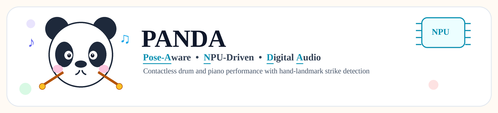
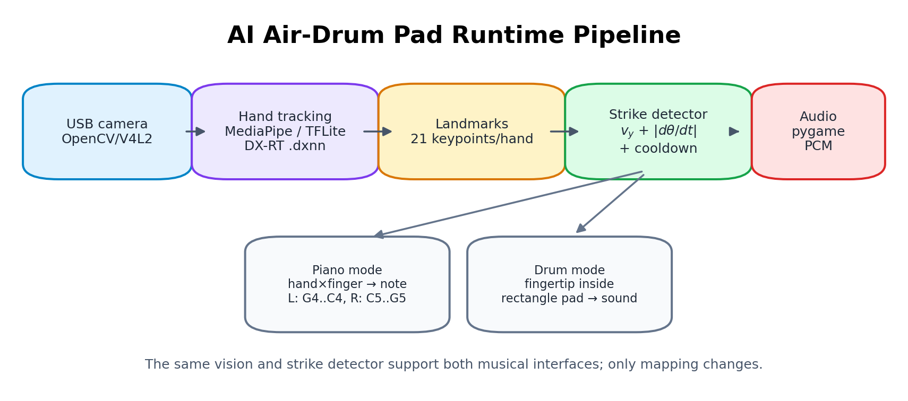
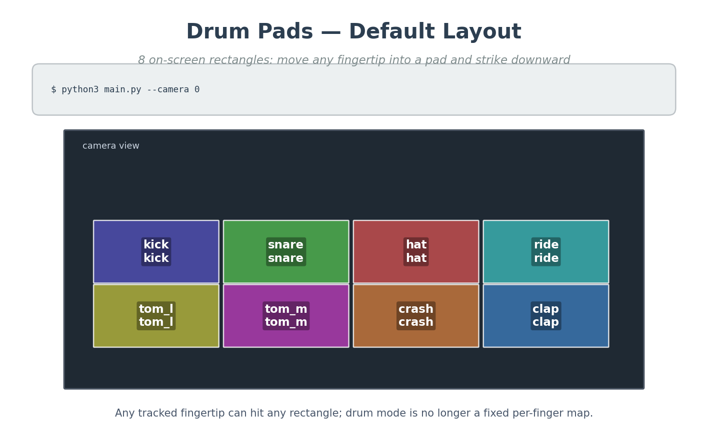
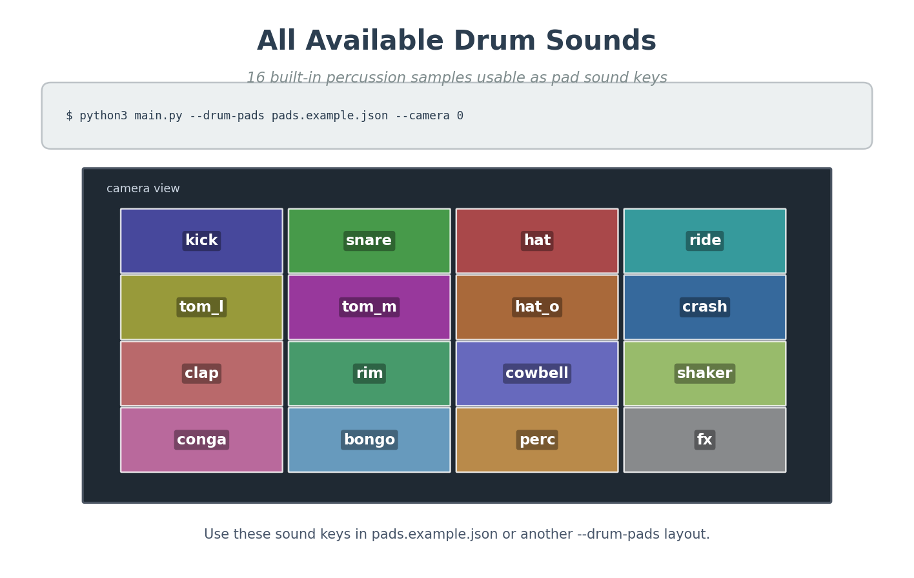
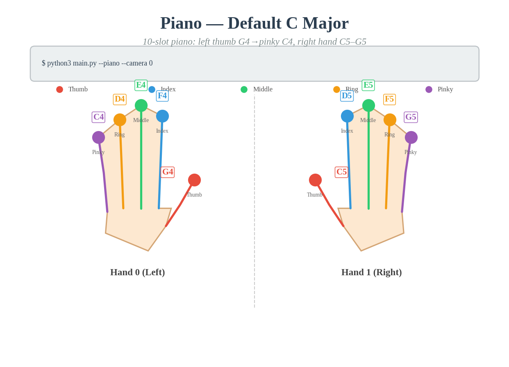
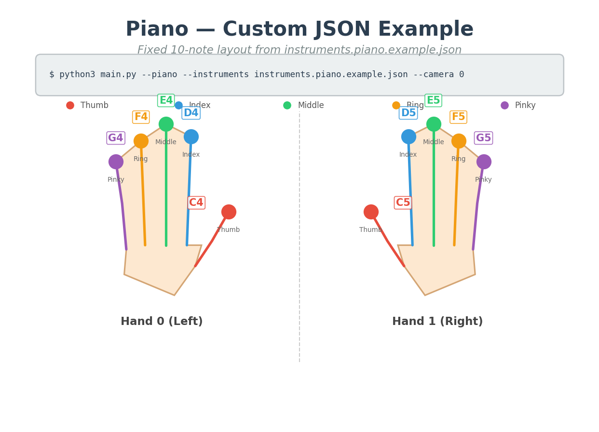
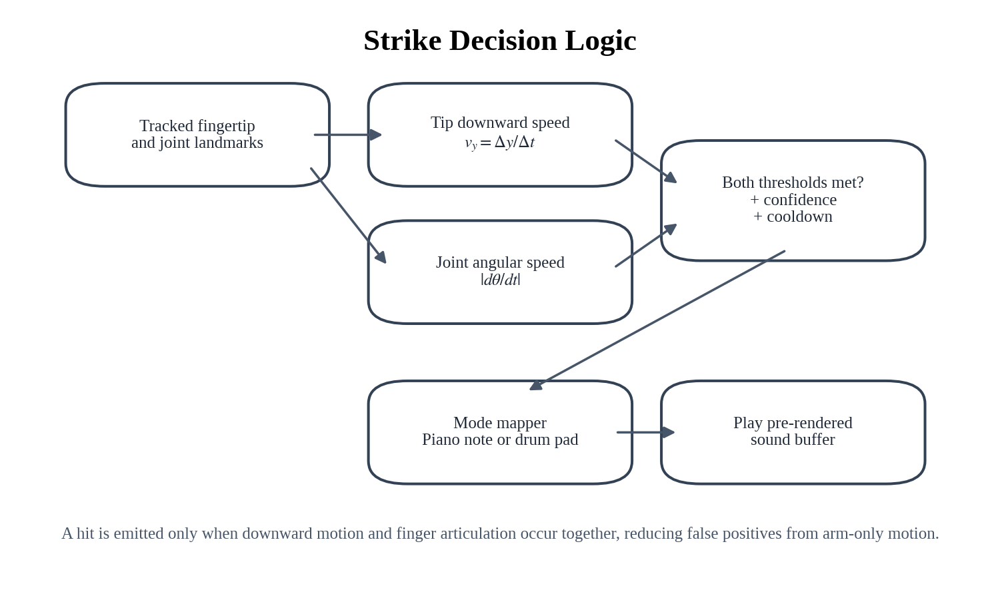
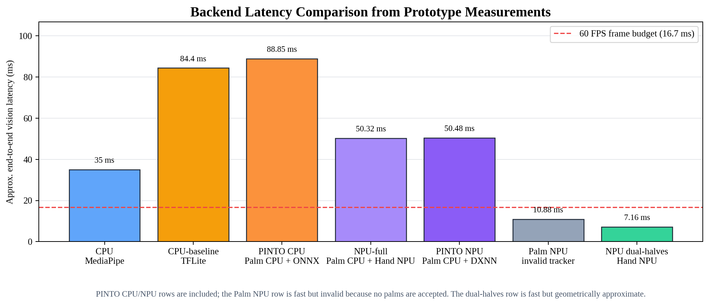

# PANDA: **<u>P</u>**ose-**<u>A</u>**ware **<u>N</u>**PU **<u>D</u>**igital **<u>A</u>**udio Interface for Contactless Musical Performance



**Acronym expansion:** **<u>P</u>**ose-**<u>A</u>**ware **<u>N</u>**PU **<u>D</u>**igital **<u>A</u>**udio Interface

**Final Report**

**Authors:** FILLME

**Affiliation:** FILLME

**Date:** 2026-05-27

**Source availability:** Private implementation artifact; the GitHub repository and source code are not publicly released.

---

## Abstract

This report presents **PANDA**, short for **<u>P</u>**ose-**<u>A</u>**ware **<u>N</u>**PU **<u>D</u>**igital **<u>A</u>**udio Interface, the final titled version of **AI Air-Drum Pad**, a real-time camera-based musical interface that converts hand and finger motions into playable drum and piano events. The system tracks hand landmarks from a USB camera, estimates downward fingertip velocity and finger-joint angular velocity, and triggers audio only when both motion cues indicate an intentional strike. Two musical modes are implemented on the same perception-and-strike-detection core: (1) a **drum pad mode**, where any fingertip may strike an on-screen rectangular pad, and (2) a **piano mode**, where notes are mapped to hand and finger identity. The final piano default layout maps the left hand from thumb to pinky as `G4, F4, E4, D4, C4` and the right hand as `C5, D5, E5, F5, G5`. The implementation supports CPU MediaPipe, CPU TFLite baseline, hybrid CPU+NPU hand-landmark inference, and a low-latency NPU dual-halves mode. Evaluation utilities and unit tests validate strike detection, pad-zone parsing, piano-note mapping, ROI transforms, and benchmark helpers. Prototype measurements show that the low-latency NPU dual-halves backend can approach the 60 FPS frame budget, while the more accurate palm-detection pipeline is limited by CPU palm detection. The project demonstrates a practical path toward low-cost, contactless musical instruments on edge AI hardware, with clear remaining work in end-to-end audio-latency measurement, robust hit-accuracy evaluation, and user studies.

**Keywords:** PANDA, contactless musical interface, hand tracking, gesture recognition, air drums, virtual piano, edge AI, NPU, real-time interaction

---

## 1. Introduction

Musical performance interfaces traditionally rely on physical contact: a drumstick contacts a drumhead, or a finger depresses a piano key. Contact provides both tactile feedback and a clear sensing event. However, camera-based hand tracking makes it possible to build **contactless musical instruments** that require no specialized controller beyond a camera and display. Such systems are attractive for prototyping, education, accessibility, public installations, and embedded AI demonstrations.

The main challenge is that visually recognizing a musical strike is harder than recognizing a static hand pose. A simple fingertip-position trigger produces false positives when the whole hand moves, while a simple velocity trigger may fire during non-musical gestures. PANDA addresses this by combining two motion cues:

1. **Fingertip downward velocity**: the fingertip moves rapidly in the image direction associated with a striking motion.
2. **Finger-joint angular velocity**: the finger itself articulates, distinguishing a deliberate finger strike from arm-only translation.

This report summarizes the final implemented system, its two musical modes, generated visual assets, software architecture, testing strategy, and prototype performance measurements.

### 1.1 Contributions

The implemented project contributes:

- A real-time hand-landmark musical interface supporting both **drum pad** and **piano** modes.
- A common strike detector using fingertip velocity plus joint angular velocity.
- A pad-zone drum interface with configurable rectangular hit regions and visual flash feedback.
- A piano interface with a corrected default mapping: left thumb `G4`, left pinky `C4`, right hand `C5–G5`.
- Generated interface diagrams for both modes.
- Report figures generated programmatically for system architecture, strike logic, and backend latency.
- A repeatable private validation pipeline covering mapping, detector behavior, pad validation, ROI helpers, and benchmark helpers.

---

## 2. System Overview

Figure 1 summarizes the runtime pipeline. Frames are captured from a USB camera, processed by one of several hand-tracking backends, converted into per-hand landmark coordinates, passed to the strike detector, mapped to either piano notes or drum pad sounds, and finally played through pre-rendered PCM audio buffers.



The same vision pipeline and strike detector support both musical modes. The mapping layer changes according to mode:

- **Piano mode:** `hand_id × fingertip_id → note name`.
- **Drum mode:** `fingertip position inside pad rectangle → drum sound`.

### 2.1 Implemented Modes

#### Drum Pad Mode

Drum mode no longer uses a fixed per-finger drum mapping. Instead, it uses normalized on-screen rectangles. Any tracked fingertip can play a pad if the strike detector fires while the fingertip is inside that pad. The default layout has eight pads: kick, snare, hat, ride, tom_l, tom_m, crash, and clap.



A larger diagram lists all built-in drum sound keys available for custom pad layouts.



#### Piano Mode

Piano mode maps fingers to notes. The final default layout is:

| Hand | Thumb | Index | Middle | Ring | Pinky |
|------|-------|-------|--------|------|-------|
| Left / Hand 0 | G4 | F4 | E4 | D4 | C4 |
| Right / Hand 1 | C5 | D5 | E5 | F5 | G5 |

This preserves the user's intended left-hand orientation: the **left thumb is G4** and the **left pinky is C4**, while the right hand remains ascending from C5 to G5.



A custom JSON piano layout example is also generated using the same default slot order.



### 2.2 Manual Screenshots Still Required

Some figures require live hardware capture rather than offline generation. They are left as FILLME placeholders:


---

## 3. Background and Related Work

PANDA sits at the intersection of gesture-based musical interfaces, real-time hand tracking, and embedded edge AI. Prior gesture instruments often use depth cameras, wearable sensors, inertial measurement units, or vision-based pose estimation. Compared with wearable sensors, camera-only systems reduce setup cost and improve accessibility, but they must infer intent from noisy visual motion alone.

This project uses a hand-landmark approach similar to modern single-camera hand-pose systems: a palm or hand detector localizes the hand, a landmark network estimates keypoints, and application logic derives gestures from keypoint dynamics. The project also investigates CPU/NPU deployment trade-offs, because low-latency musical interaction requires both accurate perception and rapid audio response.

The implementation is intentionally modular: hand tracking can be swapped across backends, while strike detection and sound mapping remain independent of the model runtime.

---

## 4. Methods

### 4.1 Hand-Landmark Representation

Each detected hand is represented by 21 normalized landmarks. The application uses five fingertip indices:

| Finger | Landmark index |
|--------|----------------|
| Thumb | 4 |
| Index | 8 |
| Middle | 12 |
| Ring | 16 |
| Pinky | 20 |

For each fingertip, a three-point chain is selected for angular motion. For example, the index finger uses MCP-PIP-TIP landmarks. The thumb uses a thumb-specific chain involving the IP joint.

### 4.2 Strike Detection

A strike is emitted only when two independent conditions hold at the same time. Figure 6 shows the decision logic.



Let \(y_t\) be the fingertip's normalized vertical image coordinate at time \(t\). The downward fingertip velocity is approximated by

\[
v_y = \frac{y_t - y_{t-1}}{t - t_{t-1}}.
\]

Because image coordinates increase downward, positive \(v_y\) indicates downward motion. Let \(\theta_t\) be the angle at the selected finger joint. Joint angular speed is approximated by

\[
\omega = \left|\frac{\theta_t - \theta_{t-1}}{t - t_{t-1}}\right|.
\]

A strike candidate satisfies

\[
v_y \ge \tau_v \quad \land \quad \omega \ge \tau_\omega.
\]

The detector then applies confidence filtering, minimum displacement filtering, and cooldown logic. The middle finger has a lower internal threshold scale because its visual angular change is often smaller than the other fingers in camera coordinates.

### 4.3 Drum Pad Mapping

Each drum pad is a normalized rectangle

\[
(x_1, y_1, x_2, y_2), \quad 0 \le x_1 < x_2 \le 1, \quad 0 \le y_1 < y_2 \le 1.
\]

If a fingertip strike occurs and the fingertip coordinate lies inside a pad, the detector returns that pad's sound key. Cooldown is tracked by pad label, allowing different pads to be played in rapid sequence.

Custom drum layouts are loaded from JSON:

```json
{
  "pads": [
    {"label": "kick", "sound": "kick", "x1": 0.05, "y1": 0.35, "x2": 0.29, "y2": 0.59, "color": [80, 80, 180]}
  ]
}
```

### 4.4 Piano Mapping

Piano mapping uses a 10-slot tuple ordered as:

```text
[Hand 0 thumb, index, middle, ring, pinky,
 Hand 1 thumb, index, middle, ring, pinky]
```

The final default tuple is:

```python
("G4", "F4", "E4", "D4", "C4", "C5", "D5", "E5", "F5", "G5")
```

This mapping is implemented as the default runtime note configuration and is also mirrored in the private example configuration used for custom piano layouts.

### 4.5 Audio Generation

The system pre-renders synthetic drum and piano sounds into `pygame.mixer.Sound` objects to avoid synthesizing audio on every strike. Piano tones are approximately 0.5 seconds long. Short drum samples were lengthened so triggered sounds remain audible despite perception and output latency.

---

## 5. Implementation

### 5.1 Private Implementation Modules

The source repository is not publicly released. For reproducibility of the academic description, the implementation is summarized by functional module rather than by public source path.

| Private module | Role |
|----------------|------|
| Runtime controller | Camera loop, backend selection, mode selection, drawing, sidebar UI, sound triggering |
| Hand-tracking layer | CPU MediaPipe, CPU-baseline TFLite, NPU, and NPU-full tracker abstractions |
| Strike-detection layer | Finger strike detector, pad strike detector, pad layout validation |
| Audio layer | Synthetic drum samples, piano note synthesis, default piano slots |
| Figure-generation utilities | Drum/piano mapping images and report diagrams |
| Validation suite | Unit tests for strike detection, mapping, ROI helpers, and benchmark helpers |

### 5.2 Runtime Backends

The application supports four major backend configurations.

| Backend | Palm detection | Hand landmarks | Intended use |
|---------|----------------|----------------|--------------|
| `cpu` | MediaPipe internal | MediaPipe internal | Simple CPU-only baseline |
| `cpu-baseline` | CPU TFLite | CPU TFLite | Comparable pipeline without NPU |
| `npu-full` | CPU TFLite | NPU `.dxnn` | Accurate palm pipeline with NPU hand inference |
| `npu` | none / dual-halves approximation | NPU `.dxnn` | Fastest low-latency approximation |

The NPU-full path is architecturally preferred for accurate hand localization, but CPU palm detection dominates latency. The dual-halves NPU mode is faster because it removes palm detection, but it is a geometric approximation and should be evaluated under the target camera setup.

### 5.3 User Interface

The runtime display contains the camera feed, hand/finger landmark trails, mode-specific overlays, and a sidebar. In drum mode, rectangles are drawn directly on the camera feed and flash briefly when hit. In piano mode, the sidebar shows the hand-to-note mapping and recent note events.

The generated diagrams are used both as report figures and as sidebar assets, keeping the report and runtime UI consistent without requiring public source-code distribution.

---

## 6. Experimental Methodology

### 6.1 Software Validation

The current quality gate is:

```bash
RUN_BENCH_SMOKE=0 ./scripts/check_quality.sh
```

This performs Python syntax checks, unit tests, and palm decode tests. The benchmark smoke test is skipped when model files or hardware-specific dependencies are unavailable.

### 6.2 Backend Latency Measurement

The backend evaluation was designed to separate three questions that are often conflated in a real-time vision instrument:

1. How fast is a simple CPU-only hand-tracking baseline?
2. How much of the latency comes from palm detection versus hand landmark inference?
3. Does the NPU accelerate the part of the pipeline that is actually deployed on the NPU, and what accuracy risks are introduced by faster approximations?

For that reason, four runtime configurations were evaluated rather than a single prototype.

| Configuration | What it evaluates | Why this baseline is required |
|---------------|-------------------|-------------------------------|
| `cpu` / MediaPipe | End-to-end CPU reference using MediaPipe's built-in palm and hand stack | Establishes the simplest robust baseline and verifies that the musical logic works without model-conversion dependencies |
| `cpu-baseline` | Palm TFLite + hand landmark TFLite, both on CPU | Uses the same two-stage palm→ROI→hand structure as `npu-full`, so it isolates whether replacing only hand inference with NPU is beneficial |
| `npu-full` | Palm TFLite on CPU + hand landmark `.dxnn` on NPU | Tests the intended accurate hybrid edge-AI pipeline while preserving reliable float32 palm detection |
| `npu` dual-halves | No palm detector; screen split into two approximate hand regions; hand landmark `.dxnn` on NPU | Estimates the low-latency lower bound when palm detection is removed, useful for live demos but less robust to hand placement |

The main evaluation metric in this report is **vision-loop latency**: time spent in camera-frame processing, palm/hand inference, ROI handling, and landmark production before the audio trigger logic. This is not a full acoustic end-to-end latency measurement. The target interactive frame budget is 16.7 ms for 60 FPS, while the final acoustic measurement should separately report motion-to-sound latency.

The hardware/software environment for the recorded prototype measurements was:

| Item | Value |
|------|-------|
| Board | Orange Pi 5 Plus (RK3588, aarch64) |
| OS / Python | Linux, Python 3.10.12 |
| DX-RT / `dx_engine` | 1.1.4 |
| DX-COM | v2.1.0-rc.4 on external compile server |
| Camera | USB camera, 640×480 |
| Offline dataset | 90 captured frames in `dataset/frame_*.png` |

The palm detector was also tested as an NPU `.dxnn` candidate. Although the NPU palm model was fast at roughly 12 ms, INT8 quantization damaged the score head: ONNX-to-NPU score correlation was approximately -0.11, making real hand detection unreliable. Therefore, all accurate palm-based configurations use CPU TFLite palm detection, and palm detection remains the main latency bottleneck.



### 6.3 Required Manual Measurements

A complete academic evaluation still requires manual measurements of the physical interaction loop. The protocols are defined here so that the missing data can be inserted directly into this report rather than stored only in auxiliary notes.

1. **End-to-end audio latency:** record the performer's hand and the speaker output simultaneously using a high-speed camera or synchronized audio/video setup. For each strike, identify the video frame where the downward hit begins and the first audio waveform onset at the speaker. Compute `Delta t = t_audio - t_video`. Use at least 30 strikes per mode and report mean, standard deviation, and P95 latency.
2. **Hit accuracy:** run metronome-guided trials in both drum and piano modes. A true positive is an intended strike detected within the allowed time window. A false negative is an intended strike with no valid event. A false positive is an unintended or duplicate event outside the allowed window. Report TP, FP, FN, precision, recall, and qualitative failure cases.
3. **Per-run logging:** retain the git commit, backend, camera resolution, model paths/checksums, `vy_trigger`, `joint_dps`, `cooldown`, lighting conditions, and raw event log fields such as `t`, `frame_id`, `infer_ms`, `hand_id`, `finger_id`, `pad/note`, and `trigger`.

The following figures are still placeholders because they require live hardware capture.


---

## 7. Results

### 7.1 Functional Results

The implementation satisfies the main functional goals:

- Detects hand landmarks from live camera input.
- Detects intentional strikes using fingertip and joint dynamics.
- Plays piano notes from hand/finger identity.
- Plays drum sounds from on-screen rectangular pad hits.
- Supports custom piano-note JSON and drum-pad JSON layouts.
- Shows generated mapping diagrams in documentation and runtime sidebar.

### 7.2 Current Test Results

The latest validation run produced:

| Test group | Result |
|------------|--------|
| Python syntax check | Passed |
| Unit tests | 28/28 passed |
| Palm decode tests | 15/15 passed |
| Dataset benchmark smoke | Skipped intentionally with `RUN_BENCH_SMOKE=0` |

The unit tests cover default piano mapping, synthetic audio duration, pad-zone generation, pad JSON validation, instrument slot validation, strike detector thresholds, middle-finger sensitivity, cooldown behavior, ROI helpers, benchmark helper functions, and dataset capture indexing.

### 7.3 Backend Performance Summary

The table below reports the high-level latency comparison for the four evaluated runtime configurations. The `cpu` row is a practical reference path. The `cpu-baseline` and `npu-full` rows form the controlled CPU-vs-NPU comparison because they share the same palm→ROI→hand pipeline and differ only in hand landmark inference. The `npu` dual-halves row is not an accuracy-equivalent baseline; it is a low-latency approximation that removes palm detection to estimate the best-case live-demo path.

| Backend | Palm stage | Hand stage | Approx. total for 2 hands | Interpretation |
|---------|-----------:|-----------:|--------------------------:|----------------|
| `cpu` (MediaPipe) | ~15 ms | ~10 ms | ~35 ms | Simple CPU-only functional baseline; no extra model files required |
| `cpu-baseline` (TFLite) | ~95 ms | ~5 ms | ~105 ms | Same two-stage structure as `npu-full`; isolates the hand-landmark accelerator comparison |
| `npu-full` (TFLite + NPU) | ~95 ms | ~8 ms | ~111 ms | Accurate hybrid path, but CPU palm detection dominates total time |
| `npu` dual-halves | 0 ms | ~8 ms × 2 | ~16 ms | Fastest path and close to 60 FPS budget, but it approximates hand location without palm detection |

The result has two important implications. First, moving only the hand landmark model to NPU is insufficient when CPU palm detection still dominates the accurate pipeline. Second, the low-latency dual-halves path is valuable for demonstrations, but it should not be treated as accuracy-equivalent to the palm-based configurations because it assumes stable hand placement.

### 7.4 Offline Dataset Benchmark Summary

A 90-frame offline benchmark was run to compare the two structurally matched pipelines, `cpu-baseline` and `npu-full`, using the same captured input frames. This benchmark removes live camera variability and focuses on per-frame processing latency and landmark agreement.

| Configuration | Mean latency | P95 latency | Component profile | Interpretation |
|---------------|-------------:|------------:|-------------------|----------------|
| `cpu-baseline`, palm every frame | 84.40 ms | 86.78 ms | palm 39.26 ms + hand 44.80 ms | CPU TFLite reference for the two-stage pipeline |
| `npu-full`, palm every frame | 50.32 ms | 54.52 ms | palm 40.93 ms + hand 9.13 ms | Same palm/ROI path, but hand inference is moved to NPU |
| `npu-full`, `--palm-redetect-every 5` (20-frame smoke) | 15.29 ms | 50.96 ms | palm frames 3/20, tracking frames 17/20 | Shows latency potential of palm skipping, but drift and hit accuracy must be verified |
| `npu-full`, `--async-palm` smoke | 10–20 ms range | input-pacing dependent | tracking with asynchronous palm refresh | Experimental path; live stability still needs validation |

The matched `cpu-baseline` vs. `npu-full` comparison shows that the NPU substantially reduces hand-landmark time in the TFLite-style pipeline (44.80 ms to 9.13 ms in the recorded 90-frame run). However, palm detection remains about 40 ms, so the accurate pipeline still exceeds the 60 FPS target unless palm frequency is reduced or palm detection is accelerated.

Landmark accuracy was estimated by comparing `npu-full` landmarks against the CPU-baseline reference in normalized image coordinates.

| Hand | Matched frames | Mean error over 21 points | Mean fingertip error | Mean max error | Worst max error |
|------|---------------:|--------------------------:|---------------------:|---------------:|----------------:|
| Right | 90 | 0.0270 | 0.0336 | 0.0532 | 0.1593 |
| Left | 83 | 0.0256 | 0.0353 | 0.0457 | 0.0734 |

An affine correction model was then fit to reduce systematic NPU landmark bias. On the same 90-frame training set, the corrected errors were:

| Hand | Matched frames | Mean error over 21 points | Mean fingertip error | Mean max error | Worst max error |
|------|---------------:|--------------------------:|---------------------:|---------------:|----------------:|
| Right | 90 | 0.0102 | 0.0112 | 0.0223 | 0.1701 |
| Left | 83 | 0.0092 | 0.0090 | 0.0193 | 0.0437 |

The correction reduces average and fingertip error on the training capture, but it should not be reported as a generalized accuracy improvement until it is evaluated on a separate hold-out capture with different lighting, hand size, hand pose, and camera distance.

---

## 8. Discussion

### 8.1 Why Two Motion Cues Matter

A virtual instrument should not trigger whenever a hand moves. The combined velocity-and-angle criterion improves musical intent detection because it requires the fingertip to move downward and the finger to articulate. This is especially important in piano mode, where individual finger identity matters, and in drum mode, where the same fingertip can cross pad boundaries during normal movement.

### 8.2 Drum Pad Mode vs. Per-Finger Drum Mapping

The project originally used per-finger drum mapping. The final drum interface uses rectangular pads instead, which is more intuitive because it resembles a physical drum pad controller. It also lets the performer use any finger for any drum sound. The trade-off is that pad layout now depends on camera framing and screen coordinates, so calibration and visual feedback become more important.

### 8.3 Piano Mapping Convention

The final piano mapping follows the user-specified convention: left-hand thumb is highest among left-hand notes (`G4`) and left-hand pinky is lowest (`C4`), while the right hand ascends from `C5` to `G5`. This mapping matches common left-hand physical intuition when the left hand is viewed in a camera-facing diagram.

### 8.4 Edge AI Trade-Offs

The NPU accelerates hand landmark inference, but a full robust pipeline also needs palm detection. In the experiments reported above, the NPU palm candidate was fast but unusable because INT8 quantization damaged detection scores, leaving CPU TFLite palm detection in the accurate pipeline. Consequently, the most accurate NPU-full backend can be slower than expected because palm detection dominates. This suggests that future work should focus on either improving palm model quantization, replacing the detector, or reducing palm frequency while controlling drift.

---

## 9. Limitations

The current prototype has several limitations:

- **No complete final E2E audio-latency measurement** is included; a manual high-speed-camera or synchronized audio/video experiment is required.
- **No formal user study** has been conducted.
- **No final hit-accuracy table** is available for tempo-controlled trials.
- **Depth ambiguity** remains because the system uses a single RGB camera.
- **Lighting and background sensitivity** may affect landmark stability.
- **NPU-full accuracy and latency** remain limited by CPU palm detection.
- **Tactile feedback is absent**, so timing may feel different from physical instruments.

---

## 10. Future Work

Recommended next steps are:

1. Capture final live screenshots for the FILLME figures.
2. Measure E2E audio latency using a high-speed camera and synchronized audio waveform.
3. Run hit-accuracy trials for both modes at multiple tempos.
4. Add per-user calibration for pad positions, handedness, and strike thresholds.
5. Investigate palm detector alternatives suitable for NPU deployment.
6. Add optional MIDI output so the system can drive external instruments.
7. Add visual/audio metronome support for controlled evaluation.
8. Conduct a small user study comparing playability of drum and piano modes.

---

## 11. Conclusion

PANDA demonstrates a complete camera-based musical interface that converts hand motion into playable drum and piano events. The final implementation includes a pad-based drum interface, a corrected piano note mapping, low-latency audio playback, generated documentation diagrams, and a repeatable validation suite. The project shows that edge AI hand tracking can support expressive contactless musical interaction, but also highlights the importance of robust strike detection, accurate hand localization, and careful latency measurement. With further evaluation and NPU optimization, the system can serve as a strong foundation for embedded AI musical interfaces and real-time gesture-control demonstrations.

---

## Acknowledgments

FILLME: course, advisor, lab, hardware provider, or collaborator acknowledgments.

---

## References

[1] PANDA / AI Air-Drum Pad private project artifact: implementation, validation outputs, generated figures, instrument images, and recorded benchmark artifacts retained privately by the project authors and summarized in this self-contained report.
[2] MediaPipe Hands / hand landmark model family, used through CPU MediaPipe and TFLite-derived pipeline paths.
[3] OpenCV, used for camera capture, drawing, and display.
[4] pygame, used for low-latency playback of pre-rendered PCM sound buffers.
[5] DeepX DX-RT / DX-COM toolchain, used for `.dxnn` NPU hand-landmark inference experiments.

---

## Appendix A. Artifact Availability and Private Validation Workflow

The GitHub repository and source code are not publicly released. The report is therefore written as a self-contained technical description: all system design, mode mappings, strike-detection equations, backend definitions, benchmark settings, and measured values needed for review are included in the main text.

The private implementation was validated using the following internal workflow:

1. Regenerate the interface diagrams and report figures from the private artifact.
2. Export the English and Korean reports to Markdown, DOCX, and PDF.
3. Run Python syntax checks, unit tests, and palm-decode tests.
4. Verify DOCX package integrity and PDF generation.
5. Record the exact private build revision used for submission.

No public GitHub URL, source archive, or source-code listing is required for reading this report. If an evaluator requires code access, it should be provided separately through the course's private submission channel.

---

## Appendix B. Private Artifact Summary

| Artifact category | Description |
|-------------------|-------------|
| Runtime application | Private camera-to-audio application for drum and piano modes |
| Tracking backends | CPU MediaPipe, CPU TFLite baseline, hybrid CPU+NPU, and NPU dual-halves paths |
| Strike-detection logic | Fingertip velocity, joint angular velocity, confidence filtering, and cooldown handling |
| Configuration examples | Private drum-pad and piano-note layout examples used to generate the figures |
| Generated figures | Report diagrams, instrument layout images, and the PANDA icon included in this report |
| Validation outputs | Syntax checks, unit tests, palm-decode tests, DOCX integrity checks, and PDF export checks |
