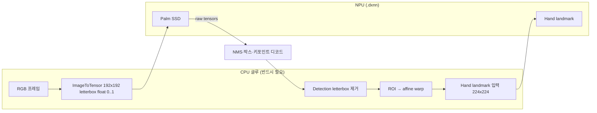

# 계획: Palm(NPU) + Hand landmark(NPU) — MediaPipe Hands 동급 파이프라인

**다음 세션에서 바로 실험할 순서:** [`NEXT_SESSION_NPU_PALM.md`](NEXT_SESSION_NPU_PALM.md) (Step A~F, 명령어·완료 기준).

## 목표

| 단계 | 내용 |
|------|------|
| 최종 | 손 **검출(박스/키포인트)** 과 **21 랜드마크**를 모두 `.dxnn` + DX-RT로 돌리고, MediaPipe `hands` 그래프와 동일한 **전처리·앵커·NMS·letterbox 제거** 규칙을 Python에서 재현한다. |
| 중간 | Palm은 TFLite(CPU)만 검증 → ONNX/DX-COM 성공 시 NPU로 이전. |

## 아키텍처 (MediaPipe `palm_detection_cpu.pbtxt` 기준)



- **Palm 모델**: `192×192` 입력, SSD식 출력 → **앵커 2016개**, `TensorsToDetections` 옵션은 저장소 `tools/palm_mp_spec.py`에 고정값으로 둠 (MediaPipe 상수와 동일).
- **Hand landmark 모델**: 기존 `hand_landmark_lite.dxnn` — Palm이 만든 **손 ROI**에 맞춰 크롭·워프한 뒤 넣어야 CPU MediaPipe와 유사한 품질이 난다.

## 단계별 실행 계획

### Phase 0 — 완료 (이번 커밋)

- [x] `tools/palm_mp_spec.py`: MediaPipe `palm_detection_cpu.pbtxt`와 동일한 **SSD / 디코딩 / NMS / letterbox 입력** 상수.
- [x] `tools/palm_letterbox.py`: `ImageToTensorCalculator`에 대응하는 **192×192, keep aspect, [0,1], zero pad**.
- [x] `tools/export_mediapipe_palm_onnx.py`: pip `mediapipe` 번들에서 `palm_detection_{lite,full}.tflite` 복사 + `tflite2onnx` 시도 + ONNX I/O 출력(성공 시).
- [x] `tools/smoke_palm_interpreter.py`: `tensorflow` 또는 `tflite_runtime` 있으면 Palm TFLite **입출력 shape** 스모크.
- [x] 본 문서.

### Phase 1 — Palm 출력 디코드 (CPU, NumPy)

- [x] `tools/palm_decode.py`: `SsdAnchorsCalculator`와 동등한 **앵커 생성** (C++ `ssd_anchors_calculator.cc` 이식).
- [x] `TensorsToDetectionsCalculator` 규격 반영: `num_boxes=2016`, `num_coords=18`, `keypoint_coord_offset=4`, `num_keypoints=7`, `reverse_output_order=true`, `sigmoid_score=true`, 스케일 192 등 (`palm_mp_spec.py` 참조).
- [x] `NonMaxSuppressionCalculator` 규화: IoU, `min_suppression_threshold=0.3`, WEIGHTED.
- [x] `DetectionLetterboxRemovalCalculator`: `palm_letterbox`가 돌려준 padding 메타로 박스를 **원본 이미지 정규 좌표**로 되돌림.
- [x] 단위 테스트: `tools/test_palm_decode.py` — 20/20 통과. MediaPipe `Hands` wrist 위치가 우리 palm 박스 안에 포함, 키포인트 거리 0.07 이내.

### Phase 2 — Hand ROI → landmark 입력

- [x] MediaPipe `hand_landmark_tracking` 그래프의 **RectTransformation** / **warp** 규칙 이식 (회전·스케일·종횡비). `tools/palm_roi.py` — Palm의 7개 키포인트로 손 사각형을 정의, affine warp 224×224, 역변환.
- [x] 기존 `DxnnHandTracker`가 받는 크롭을 "전체 프레임"이 아니라 **위 ROI**로 제한 — `FullNpuHandsTracker`에서 사용.

### Phase 3 — Palm `.dxnn`

- [x] ONNX 변환: `tools/dequant_palm_fp32.py` — flatc JSON 라운드트립으로 FP16→FP32 디퀀트 + DEQUANTIZE op 제거 → `tflite2onnx` 성공. `models/vendor/palm_detection_lite.onnx` (NCHW, 3.9 MB). TFLite 대비 max_diff=0.000122.
- [x] `dx_com`으로 `palm_detection_lite.dxnn` 빌드 완료 (SNU 서버 user12, opt_level 1). `parse_model` 확인: input `input_1` NCHW, outputs `Identity`(boxes) + `Identity_1`(scores), 1 NPU + 2 CPU tasks, 48.5 MB. Div(x=255) NPU 내장.
- [x] `models/dxnn_layout.mediapipe_palm_lite.json` 초안.

### Phase 4 — 통합 트래커

- [x] `hand_tracker.py`에 `FullNpuHandsTracker`: Palm TFLite(CPU) + landmark `.dxnn`(NPU), Palm `.dxnn` 확보 시 NPU 교체 가능.
- [x] `main.py --backend npu-full` + `--palm-tflite` 플래그.

### Phase 5 — 정리

- [x] README 업데이트: `npu-full` 사용법, 도구 목록, 구현 현황 → PLAN 체크박스로 이전.

### Phase 7 — cpu-baseline 백엔드

- [x] `TFLiteHandLandmark` 클래스 (`hand_tracker.py`): `hand_landmark_lite.tflite` TFLite 랩퍼 (CPU, float32). 224×224 RGB 패치 → 21 keypoints.
- [x] `create_tracker('cpu-baseline')`: `FullNpuHandsTracker` 에 `hand_tflite_path` 전달, palm+hand 모두 CPU TFLite.
- [x] `main.py --backend cpu-baseline` + `--hand-tflite` CLI 플래그.
- [x] 테스트: 2 hands, ~105ms, wrist 좌표 npu-full과 유사.
- [x] 모든 문서 업데이트 (README, ARCHITECTURE, EXPERIMENTS, models/README, PLAN, NEXT_SESSION).

> `cpu-baseline`은 `npu-full`과 동일한 파이프라인(palm → ROI → hand landmark)을 **모두 CPU TFLite (float32)** 로 실행합니다. NPU 가속 효과를 정확히 비교할 수 있는 기준선입니다.

### Phase 8 — Dataset replay benchmark / palm-skip 실험 도구

- [x] `tools/benchmark_dataset.py`: `dataset/frame_*.png`를 카메라 대신 재생해 백엔드별 지연(mean/P95/min/max), palm/hand 세부 프로파일, 손별 landmark 오차를 출력.
- [x] `FullNpuHandsTracker.last_profile`: 프레임별 `palm_ms`, `hand_ms`, `mode`(palm/tracking), 검출 수 기록.
- [x] `--palm-redetect-every N` CLI 플래그: 기본 `0`(매 프레임 palm, 정확도 우선), `N>0`은 palm skip/ROI tracking 실험.
- [x] `npu-full` 자동 palm 선택을 TFLite 우선으로 변경. Palm .dxnn은 score head 양자화 실패가 알려져 있으므로 `--palm-dxnn`을 명시한 실험에서만 사용.
- [x] `--async-palm` 실험 옵션: background thread에서 palm을 돌리고 메인 루프는 이전 ROI로 hand landmark를 계속 추적.
- [x] `tools/sweep_palm_redetect.py`: `--palm-redetect-every` 값(예: 0,1,2,3,5,10)을 batch로 실행해 CSV/JSON 생성.
- [x] `tools/benchmark_dataset.py --debug-dir`: landmark 오차가 큰 frame의 green/reference vs red/test overlay PNG와 manifest 저장.
- [x] `tools/capture_dataset.py` manifest 기록: session/label/notes와 frame range를 `capture_manifest.json`에 누적.
- [x] `tools/calibrate_npu_landmarks.py` + `--landmark-correction`: CPU baseline 대비 NPU landmark affine 보정 JSON 생성 및 runtime/benchmark 적용.

예:

```bash
python3 tools/benchmark_dataset.py --backends cpu-baseline,npu-full
python3 tools/benchmark_dataset.py --backends cpu-baseline,npu-full --palm-redetect-every 5
python3 tools/sweep_palm_redetect.py --values 0,1,2,3,5,10 --backends cpu-baseline,npu-full
python3 tools/benchmark_dataset.py --backends cpu-baseline,npu-full --debug-dir /tmp/air_drum_debug
python3 tools/benchmark_dataset.py --backends cpu-baseline,npu-full --async-palm --frame-interval-ms 16.7
python3 tools/calibrate_npu_landmarks.py --output models/npu_landmark_correction.dataset.json
python3 tools/benchmark_dataset.py --backends cpu-baseline,npu-full --landmark-correction models/npu_landmark_correction.dataset.json
```

### Phase 6 — Palm NPU 통합 (속도 확인, 양자화 품질 실패)

- [x] `FullNpuHandsTracker` 에 `palm_dxnn_path` 지원 — `dx_engine.InferenceEngine` 로 NPU 추론.
- [x] 전처리: letterbox NHWC [0,1] → ×255 → uint8 (Div(255) NPU 내장).
- [x] `--palm-dxnn` 명시 실험 경로 지원. 초기에는 `.dxnn` 자동 탐색을 시도했으나, score head 양자화 실패 확정 후 기본 자동 탐색은 TFLite 우선으로 변경.
- [x] `--palm-dxnn` CLI 플래그 (`main.py`).
- [x] 벤치마크: Palm NPU repeated dataset runs 약 8-11 ms vs TFLite CPU 약 39-42 ms. 속도는 빠르지만 accepted palm 0으로 hand stage가 실행되지 않음.
- [x] **양자화 품질 검증: score head 파괴 확인** — TFLite↔ONNX score/box 상관은 거의 1.0이나, DXNN score 상관은 `frame_000` 기준 -0.1457, `frame_060` 기준 -0.1900. Box 상관은 약 0.82이나 box MAE가 약 21 raw units로 큼.
  - ema / minmax calibration, `--aggressive_partitioning` (0 CPU groups), opt_level 0/1 모두 실패.
  - **최종 결론: Palm .dxnn은 사용 불가. TFLite (CPU, float32) 고정.**

## 리스크·메모

- **Palm INT8 양자화 실패 (확정):** DX-COM으로 palm_detection_lite.onnx를 INT8 양자화하면 **score head가 파괴**됩니다. 2026-06-16 재진단에서 TFLite→ONNX export는 정상(score/box correlation ~1.0)이고, DXNN만 score correlation -0.1457(`frame_000`) / -0.1900(`frame_060`)로 무너졌습니다. `dx_engine` metadata는 `[1,192,192,3] uint8` 입력을 보고했고 NHWC/NCHW, uint8/float32 variants 모두 accepted detection 0이라 단순 입력 layout 문제가 아닙니다. **Palm은 TFLite (CPU, float32)로 고정.**
- **`tflite2onnx`로 palm TFLite 변환**: `tools/dequant_palm_fp32.py`로 FP16→FP32 디퀀트 후 변환 성공.
- **Palm TFLite**: `pip show mediapipe` 설치 경로의 `mediapipe/modules/palm_detection/palm_detection_lite.tflite` (스크립트가 자동 복사).
- **DX-COM**: SNU 서버 (user12, port 443) 에서 컴파일. aarch64 보드에서는 직접 컴파일 불가.

## 참고 링크

- [palm_detection_cpu.pbtxt](https://github.com/google-ai-edge/mediapipe/blob/master/mediapipe/modules/palm_detection/palm_detection_cpu.pbtxt)
- [ssd_anchors_calculator.cc](https://github.com/google-ai-edge/mediapipe/blob/master/mediapipe/calculators/tflite/ssd_anchors_calculator.cc) (앵커 생성)
