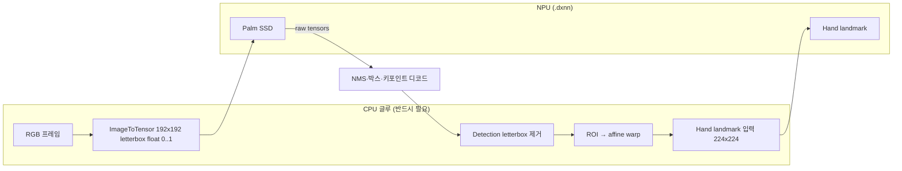

# 계획: Palm(NPU) + Hand landmark(NPU) — MediaPipe Hands 동급 파이프라인

**다음 세션에서 바로 실험할 순서:** [`NEXT_SESSION_NPU_PALM.md`](NEXT_SESSION_NPU_PALM.md) (Step A~F, 명령어·완료 기준).

## 목표

| 단계 | 내용 |
|------|------|
| 최종 | 손 **검출(박스/키포인트)** 과 **21 랜드마크**를 모두 `.dxnn` + DX-RT로 돌리고, MediaPipe `hands` 그래프와 동일한 **전처리·앵커·NMS·letterbox 제거** 규칙을 Python에서 재현한다. |
| 중간 | Palm은 TFLite(CPU)만 검증 → ONNX/DX-COM 성공 시 NPU로 이전. |

## 아키텍처 (MediaPipe `palm_detection_cpu.pbtxt` 기준)

- **Palm 모델**: `192×192` 입력, SSD식 출력 → **앵커 2016개**, `TensorsToDetections` 옵션은 저장소 `tools/palm_mp_spec.py`에 고정값으로 둠 (MediaPipe 상수와 동일).
- **Hand landmark 모델**: 기존 `hand_landmark_lite.dxnn` — Palm이 만든 **손 ROI**에 맞춰 크롭·워프한 뒤 넣어야 CPU MediaPipe와 유사한 품질이 난다.

## 단계별 실행 계획

### Phase 0 — 완료 (이번 커밋)

- [x] `tools/palm_mp_spec.py`: MediaPipe `palm_detection_cpu.pbtxt`와 동일한 **SSD / 디코딩 / NMS / letterbox 입력** 상수.
- [x] `tools/palm_letterbox.py`: `ImageToTensorCalculator`에 대응하는 **192×192, keep aspect, [0,1], zero pad**.
- [x] `tools/export_mediapipe_palm_onnx.py`: pip `mediapipe` 번들에서 `palm_detection_{lite,full}.tflite` 복사 + `tflite2onnx` 시도 + ONNX I/O 출력(성공 시).
- [x] `tools/smoke_palm_interpreter.py`: `tensorflow` 또는 `tflite_runtime` 있으면 Palm TFLite **입출력 shape** 스모크.
- [x] 본 문서.

### Phase 1 — Palm 출력 디코드 (CPU, NumPy)

- [ ] `tools/palm_decode.py` (또는 `palm_pipeline/decode.py`): `SsdAnchorsCalculator`와 동등한 **앵커 생성** (C++ `ssd_anchors_calculator.cc` 이식 또는 TF research 코드 참고).
- [ ] `TensorsToDetectionsCalculator` 규격 반영: `num_boxes=2016`, `num_coords=18`, `keypoint_coord_offset=4`, `num_keypoints=7`, `reverse_output_order=true`, `sigmoid_score=true`, 스케일 192 등 (`palm_mp_spec.py` 참조).
- [ ] `NonMaxSuppressionCalculator` 규화: IoU, `min_suppression_threshold=0.3`, WEIGHTED.
- [ ] `DetectionLetterboxRemovalCalculator`: `palm_letterbox`가 돌려준 padding 메타로 박스를 **원본 이미지 정규 좌표**로 되돌림.
- [ ] 단위 테스트: MediaPipe `Hands`가 같은 프레임에서 내부적으로 쓰는 detection과 수치 비교(허용 오차) — 가능하면 그래프 덤프 또는 중간 텐서 캡처.

### Phase 2 — Hand ROI → landmark 입력

- [ ] MediaPipe `hand_landmark_tracking` 그래프의 **RectTransformation** / **warp** 규칙 이식 (회전·스케일·종횡비). Palm의 7개 키포인트로 손 사각형을 정의하는 부분.
- [ ] 기존 `DxnnHandTracker`가 받는 크롭을 “전체 프레임”이 아니라 **위 ROI**로 제한.

### Phase 3 — Palm `.dxnn`

- [ ] Phase 0에서 ONNX 변환이 실패하면: **TF Lite → SavedModel → ONNX** (ai-edge-torch / tf2onnx 등) 또는 DEEPX 권장 변환 경로 조사.
- [ ] `dx_com`으로 `palm_detection_lite.dxnn` 빌드, `parse_model`로 입출력 확인.
- [ ] `models/dxnn_layout.mediapipe_palm_lite.json` 초안.

### Phase 4 — 통합 트래커

- [ ] `hand_tracker.py`에 `FullNpuHandsTracker` (가칭): Palm `.dxnn` + landmark `.dxnn`, 실패 시 Palm만 TFLite 폴백 등.
- [ ] `main.py --backend npu-full` 또는 `--palm-dxnn` / `--hand-dxnn` 플래그.

### Phase 5 — 정리

- [ ] README / `models/README.md`에 두 `.dxnn` 경로와 Phase 1~2 정확도 노트.

## 리스크·메모

- **`tflite2onnx`로 palm Tflite 변환**: 현재 보드에서 **IndexError 등으로 실패**할 수 있음 → Phase 3에서 다른 변환기 필수일 수 있음.
- **Palm Tflite**: `pip show mediapipe` 설치 경로의 `mediapipe/modules/palm_detection/palm_detection_lite.tflite` (스크립트가 자동 복사).
- **DX-COM**: Palm 그래프에 **커스텀 op / FP16** 등이 있으면 컴파일 제약이 있을 수 있음 — 컴파일 로그로 op 단위 확인.

## 참고 링크

- [palm_detection_cpu.pbtxt](https://github.com/google-ai-edge/mediapipe/blob/master/mediapipe/modules/palm_detection/palm_detection_cpu.pbtxt)
- [ssd_anchors_calculator.cc](https://github.com/google-ai-edge/mediapipe/blob/master/mediapipe/calculators/tflite/ssd_anchors_calculator.cc) (앵커 생성)
